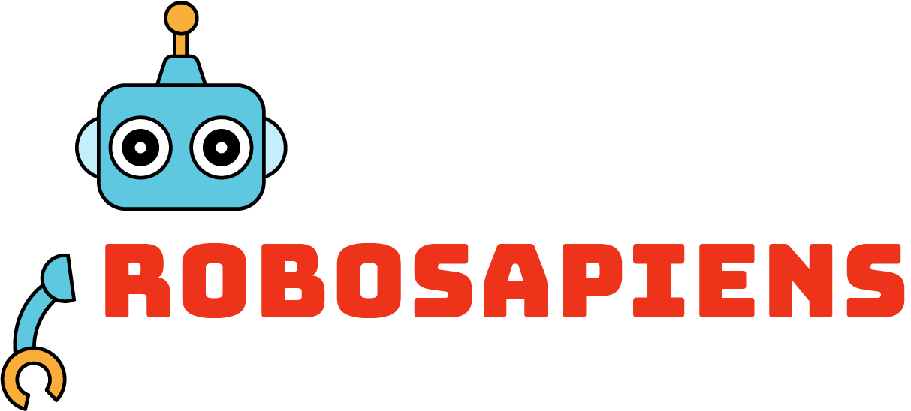

.. RoboSAPIENS IO Project documentation masterACKNOWLEDGEMENTS
================
The work presented here is supported by the RoboSAPIENS project funded by the European Commission's
Horizon Europe programme under grant agreement number 101133807.e, created by
   sphinx-quickstart on Tue Oct 29 22:52:46 2024.
   You can adapt this file completely to your liking, but it should at least
   contain the root `toctree` directive.

robosapiensIO documentation
============================

This repository provides a flexible software architecture framework for building self-adaptive, trustworthy robotic applications using the RoboSapiens Adaptive Platform. It includes modular building blocks for runtime adaptation, trustworthiness monitoring, and knowledge management, enabling the seamless deployment of adaptive systems in diverse environments. The platform supports both resource-constrained and high-performance computing setups, facilitating reliable, automated responses to changing operational conditions.

Social: `LinkedIn <https://www.linkedin.com/company/robosapiens-eu/>`_ | `Website <https://robosapiens-eu.tech/>`_

.. toctree::
   :maxdepth: 2
   :caption: Overview

   what-is-robosapiensio

.. toctree::
   :maxdepth: 2
   :caption: Getting Started

   gettingStarted/installation/index

.. toctree::
   :maxdepth: 2
   :caption: Tutorials & Examples

   gettingStarted/tutorials/index

.. toctree::
   :maxdepth: 1
   :caption: Publications

   publications

.. toctree::
   :maxdepth: 1
   :caption: Reference

   features/history
   features/supported-features
   gettingStarted/tutorials/validation

ACKNOWLEDGEMENTS
-------------
The work presented here is supported by the RoboSAPIENS project funded by the European Commission’s
Horizon Europe programme under grant agreement number 101133807